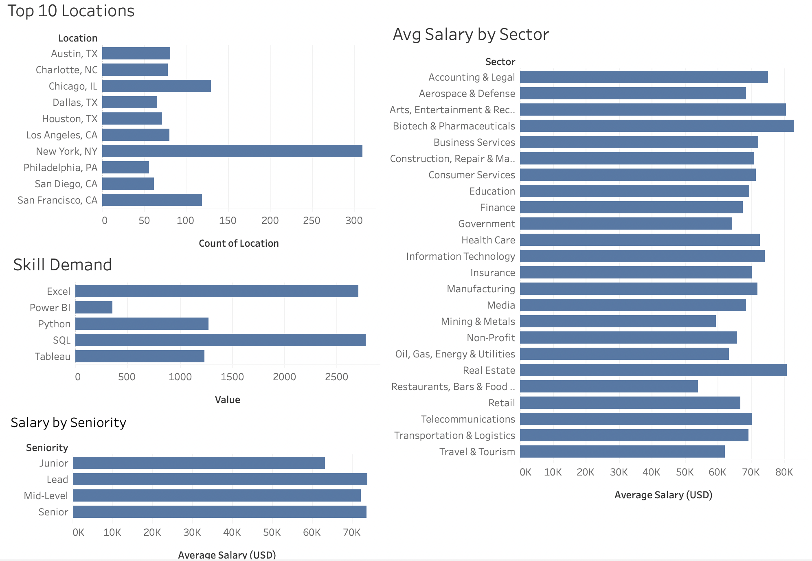

# Data Analyst Job Market Analysis
**Personal Portfolio Project**

An analysis of 2,254 real Glassdoor Data Analyst job postings to understand where the jobs are, what they pay, and which skills employers want most.

## Business Questions
* Which cities have the most Data Analyst job postings?
* Which sectors pay the highest average salaries?
* What technical skills are most in-demand?
* How does salary vary by seniority level?

## Tools & Process
* **Excel** — data cleaning with Find & Replace, LEFT/MID and SEARCH/IF formulas to extract salary ranges, clean company names, split locations into City/State, and create binary skill columns
* **Python + SQLite** — loaded the cleaned data into a database and ran the analysis in a Jupyter Notebook (GROUP BY, CASE, COUNT)
* **Tableau Public** — built and published a 4-chart interactive dashboard

## Key Findings
* **New York** has the most postings (310), followed by Chicago (130) and San Francisco (119)
* **Biotech & Pharmaceuticals** offers the highest average salary (~$83K)
* **SQL (62%) and Excel (60%)** are the most in-demand skills, followed by Python and Tableau (28% each) and Power BI (8%)
* **Junior roles earn ~$10K less** than mid- and senior-level positions

## Data Quality Note
While validating the skill counts, I noticed a total that was impossible — the SQL column summed to 2,778 across only 2,254 postings. I traced it to stray values in the skill columns and a chart that was *summing* them instead of *counting* postings. I rebuilt the metric to count postings where each skill = 1 (using `IF [skill] = 1 THEN 1 ELSE 0 END`), and dropped the R column, which was corrupted (flagged in 100% of rows). The corrected numbers are the ones reported above.

## Visualizations
**Top 10 Cities by Number of Postings** — where Data Analyst demand concentrates.

**Average Salary by Industry Sector** — which sectors pay the most.

**Most In-Demand Technical Skills** — skill frequency across all postings.

**Average Salary by Seniority Level** — how pay scales from junior to senior.

## Deliverables
* [Interactive Tableau Dashboard](https://public.tableau.com/app/profile/fariba.kazi/viz/DataAnalystJobMarketAnalysisProjectFaribaKazi/DataAnalystJobMarketAnalysis)
* Jupyter Notebook + SQL queries
* Cleaned dataset (Excel)

---
**Author:** Fariba Kazi · [LinkedIn](https://www.linkedin.com/in/fariba-kazi/)
