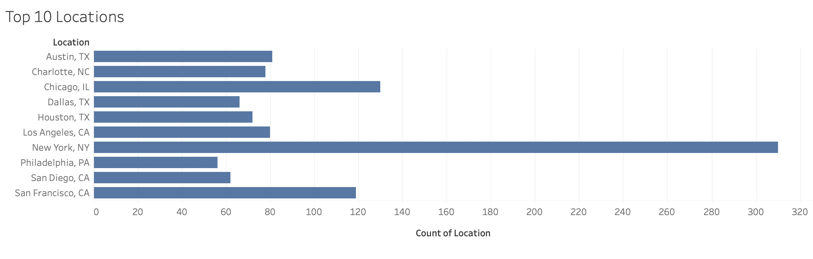
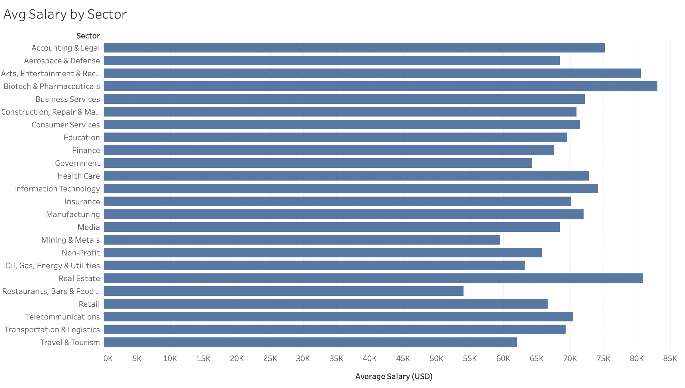
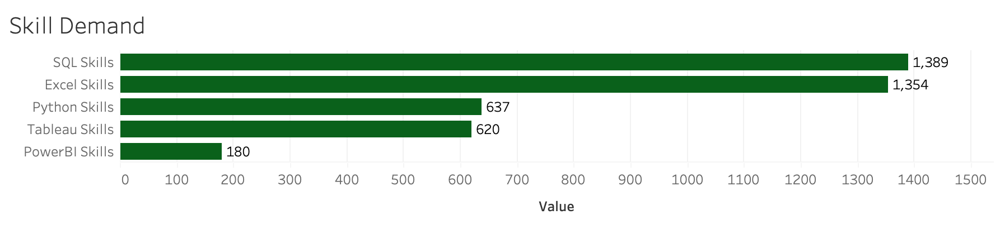
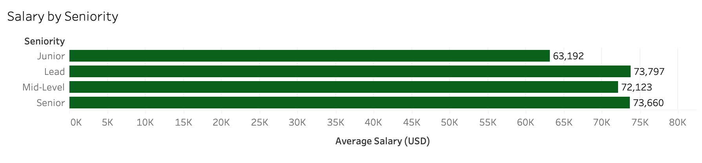

# Data Analyst Job Market Analysis

**Personal Portfolio Project**  
Analyzed 2,253 real Glassdoor Data Analyst job postings.

### Business Questions Answered
- Which cities have the most Data Analyst job postings?
- Which sectors pay the highest average salaries?
- What technical skills are most in-demand?
- How does salary vary by seniority level?

### Tools & Process
- **Excel** — Data cleaning using Find & Replace, LEFT/MID formulas, SEARCH/IF functions to extract salary ranges, clean company names, split locations into City/State, and create binary skill columns (Python, SQL, Excel, Tableau, Power BI)
- **Python + SQLite** — Loaded cleaned data into a database and ran analysis via Jupyter Notebook
- **Tableau Public** — Built and published a 4-visual interactive dashboard

### Key Findings
- **New York** has the most postings (**310**)
- **Biotech & Pharmaceuticals** offers the highest average salary (~$83K)
- **SQL** and **Excel** are the most in-demand skills (appearing in over 60% of postings)
- Junior roles earn roughly **$10K less** than mid and senior-level positions

### Visualizations

#### Top 10 Cities by Number of Data Analyst Job Postings

#### Average Salary by Industry Sector

#### Most In-Demand Technical Skills

#### Average Salary by Seniority Level

### Deliverables
- [Interactive Tableau Dashboard](https://public.tableau.com/app/profile/fariba.kazi/viz/DataAnalystJobMarketAnalysisProjectFaribaKazi/DataAnalystJobMarketAnalysis#1)
- Jupyter Notebook + SQL queries
- Cleaned dataset (Excel)
- Full analysis documentation

### Author
**Fariba Kazi**  
Economics Student | McMaster University

- GitHub: https://github.com/faribakazi  
- LinkedIn: https://www.linkedin.com/in/fariba-kazi-666260335/
